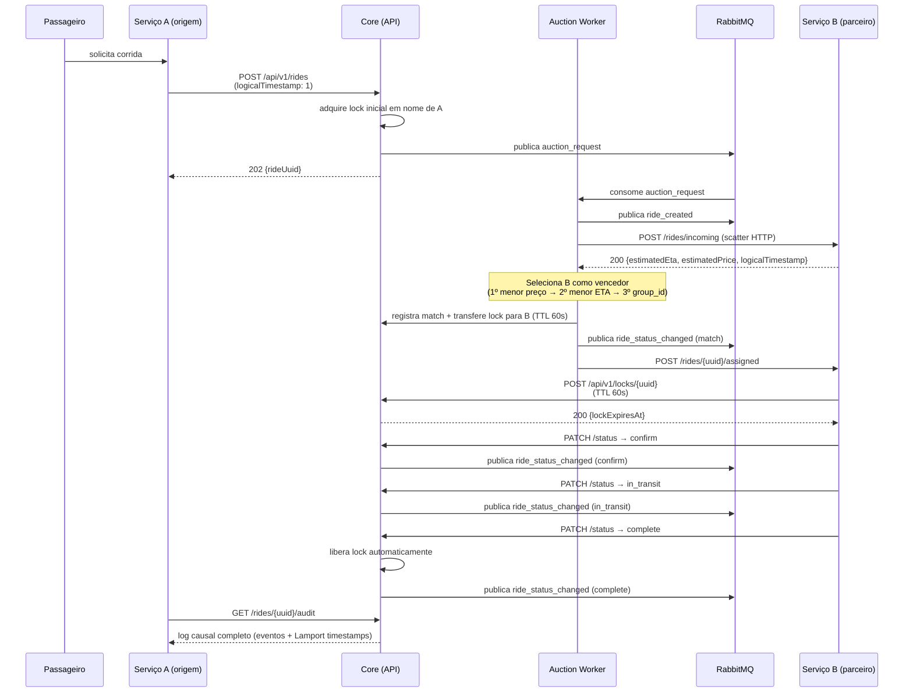
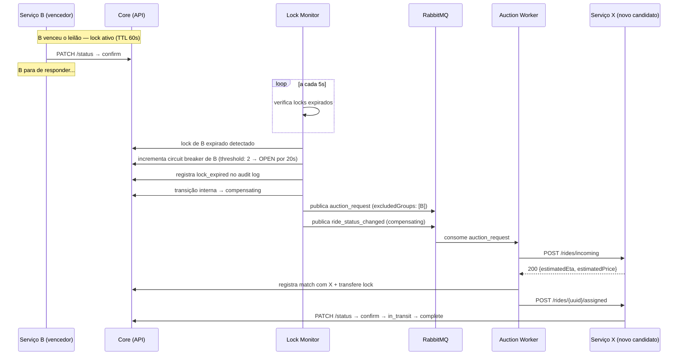

# Fluxo Completo de Delegação — RideFleet

Documentação do fluxo de delegação de corridas no ecossistema RideFleet, incluindo cenários de sucesso e falha.

---

## Cenário Feliz

### Descrição por passo

| Passo | Ator | Ação | Estado resultante |
|-------|------|------|-------------------|
| 1 | Passageiro | Solicita corrida ao Serviço A | — |
| 2 | Serviço A | `POST /rides` com origin/destination | `request` |
| 3 | Core | Adquire lock inicial (TTL 60s) em nome de A; publica `auction_request` | lock ativo |
| 4 | Auction Worker | Publica `ride_created`; chama `POST /rides/incoming` em todos os grupos elegíveis (scatter) | `request` |
| 5 | Serviço B | Responde com proposta (ETA + preço) via retorno HTTP 200 | proposta registrada |
| 6 | Auction Worker | Seleciona vencedor (menor preço → menor ETA → group_id); transfere lock para B (60s); chama `POST /rides/{uuid}/assigned` em B | `match` |
| 7 | Serviço B | `POST /locks/{uuid}` para confirmar detenção do lock | lock em B |
| 8 | Serviço B | `PATCH /status → confirm` (requer lock) | `confirm` |
| 9 | Serviço B | `PATCH /status → in_transit` (requer lock) | `in_transit` |
| 10 | Serviço B | `PATCH /status → complete` (requer lock) | `complete` (lock liberado automaticamente) |

---

## Cenário de Falha — Lock Expirado

### Como o Core detecta a falha

1. **Timeout de TTL:** o `lock_monitor` roda a cada 5s e detecta locks com `expires_at < agora`
2. **Punição via circuit breaker:** cada lock expirado incrementa o breaker do grupo faltoso; com 2+ falhas, o grupo fica bloqueado (503) por 20s
3. **Compensação automática:** o Core transiciona a corrida para `compensating`, exclui o grupo faltoso e inicia novo leilão

### Ações de compensação por estado

| Estado no momento da falha | Ação do Core |
|---------------------------|-------------|
| `match` ou posterior | Libera lock; transiciona para `compensating`; publica `auction_request` excluindo o grupo faltoso |
| Nenhuma proposta no leilão | Corrida vai direto para `cancelled` (sem re-leilão) |

> **Nota:** a corrida permanece em `compensating` enquanto o re-leilão está em curso. Se o re-leilão também falhar, vai para `cancelled`.

---

## Critério de Seleção do Vencedor do Leilão

O Core usa o seguinte critério **determinístico** (implementado em `app/workers/auction_worker.py`):

1. **Menor `estimatedPrice`** (preço estimado)
2. Em caso de empate: **menor `estimatedEta`** (tempo de chegada)
3. Em caso de empate: **ordem lexicográfica de `groupId`** (determinístico, reproduzível)

---

## Regras de Relógio de Lamport no Fluxo

- Cada serviço mantém seu próprio clock lógico local
- Ao enviar mensagem ao Core: inclua `logicalTimestamp` atual
- Core aplica `max(core_clock, received) + 1` a cada evento recebido
- O Core rejeita transições com `logicalTimestamp ≤ último registrado` para a corrida (proteção contra duplicatas/eventos atrasados)
- O log de auditoria ordena eventos por `logicalTimestamp` para reconstruir a causalidade
- Nenhum serviço deve reutilizar um timestamp já enviado para a mesma corrida
