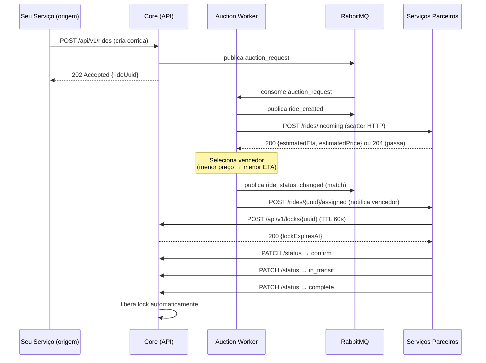

# Tutorial de Integração Local — RideFleet Core

Guia passo a passo para conectar seu serviço ao Core localmente (Semana 3).

---

## 1. Pré-requisitos

- Docker Desktop em execução (≥ 4.x)
- `curl` ou [Bruno](https://usebruno.com/) para chamadas HTTP
- ~2 GB de RAM disponíveis
- Repo `ridefleet-core` clonado

---

## 2. Subindo o Core localmente

```bash
# Copiar variáveis de ambiente
cp infra/.env.example infra/.env

# Subir core + PostgreSQL + RabbitMQ + Prometheus + Grafana
docker compose -f infra/docker-compose.core.yml up -d

# Aguardar inicialização (~15s) e verificar saúde
curl http://localhost:8080/api/v1/health
# → {"status": "ok", "version": "0.4.1", ...}
```

**Serviços disponíveis:**

| Serviço | URL |
|---------|-----|
| Core API + Swagger | http://localhost:8080/docs |
| RabbitMQ Management | http://localhost:15672 (ridefleet / ridefleet) |
| Prometheus | http://localhost:9090 |
| Grafana | http://localhost:3000 (admin / ridefleet) |

---

## 3. Registrando seu grupo

O endpoint de registro é **idempotente** — pode ser chamado a cada reinício do container sem erro.

```bash
curl -s -X POST http://localhost:8080/api/v1/groups/register \
  -H "Content-Type: application/json" \
  -d '{
    "groupId":      "meu-grupo",
    "groupName":    "Meu Grupo — SIN 142",
    "serviceUrl":   "http://meu-servico:8080",
    "contactEmail": "grupo@example.com"
  }' | python3 -m json.tool
```

- **Primeiro registro:** retorna `201` com a `apiKey` gerada.
- **Reregistro:** retorna `200` com a mesma `apiKey` (atualiza `serviceUrl` e `groupName`).

Guarde a `apiKey` — use-a no header `X-API-Key` em todas as chamadas subsequentes ao Core.

```bash
API_KEY="rfk_<sua chave aqui>"
```

---

## 4. Visão geral do fluxo de integração

Antes de executar o passo a passo, entenda **quem chama quem**:



**Ponto crítico:** o Core chama seu serviço em `POST /rides/incoming` durante o leilão — seu serviço deve implementar este endpoint e responder de forma síncrona com a proposta. Não existe um endpoint no Core para submeter propostas diretamente.

---

## 5. Endpoints que seu serviço deve implementar

O Core realiza callbacks HTTP para o `serviceUrl` que você registrou:

### `POST /rides/incoming`

Recebe uma oferta de leilão. Responda com sua proposta ou recuse.

**Request body (enviado pelo Core):**
```json
{
  "rideUuid": "uuid-da-corrida",
  "origin": {"lat": -20.75, "lng": -42.88, "street": "Rua A", "number": "1", "city": "Viçosa", "state": "MG"},
  "destination": {"lat": -20.80, "lng": -42.90, "street": "Rua B", "number": "2", "city": "Viçosa", "state": "MG"},
  "originServiceId": "grupo-origem",
  "passengerId": "uuid-passageiro",
  "logicalTimestamp": 5,
  "auctionDeadline": "2026-05-29T14:05:00Z"
}
```

**Respostas esperadas:**
- `200 OK` com `{"estimatedEta": 180, "estimatedPrice": 15.50, "logicalTimestamp": 6}` — aceita e faz proposta
- `204 No Content` — recusa (passa o leilão)

### `POST /rides/{rideUuid}/assigned`

Recebe notificação de que seu grupo ganhou o leilão.

**Request body (enviado pelo Core):**
```json
{
  "rideUuid": "uuid-da-corrida",
  "origin": {...},
  "destination": {...},
  "passengerId": "uuid-passageiro",
  "originServiceId": "grupo-origem",
  "logicalTimestamp": 8,
  "lockExpiresAt": "2026-05-29T14:06:00Z"
}
```

O Core já transferiu o lock para o seu grupo. A partir daqui, seu serviço deve chamar o Core para progredir a saga.

---

## 6. Fluxo completo — passo a passo com curl

### Passo 1 — Criar corrida e iniciar leilão

```bash
RIDE=$(curl -s -X POST http://localhost:8080/api/v1/rides \
  -H "X-API-Key: $API_KEY" \
  -H "Content-Type: application/json" \
  -d '{
    "originServiceId":      "meu-grupo",
    "passengerId":          "passageiro-demo",
    "origin":      {"lat": -20.75, "lng": -42.88, "street": "Rua A", "number": "1", "city": "Viçosa", "state": "MG"},
    "destination": {"lat": -20.80, "lng": -42.90, "street": "Rua B", "number": "2", "city": "Viçosa", "state": "MG"},
    "logicalTimestamp":     1,
    "auctionTimeoutSeconds": 10
  }')

RIDE_UUID=$(echo $RIDE | python3 -c "import sys,json; print(json.load(sys.stdin)['rideUuid'])")
echo "Corrida criada: $RIDE_UUID"
```

O Core:
1. Registra a corrida no estado `request`
2. Adquire o lock inicial em nome do seu grupo
3. Publica `auction_request` no RabbitMQ
4. Retorna `202 Accepted` imediatamente — o leilão roda em background

### Passo 2 — Aguardar o leilão e verificar resultado

```bash
# Aguardar o timeout do leilão (auctionTimeoutSeconds = 10s)
sleep 12

# Verificar estado e resultado
curl -s http://localhost:8080/api/v1/rides/$RIDE_UUID/status \
  -H "X-API-Key: $API_KEY" | python3 -m json.tool

curl -s http://localhost:8080/api/v1/rides/$RIDE_UUID/proposals \
  -H "X-API-Key: $API_KEY" | python3 -m json.tool
```

Se nenhum grupo respondeu ao `POST /rides/incoming`, o Core cancela a corrida (`cancelled`). Na demo individual, seu serviço precisa estar no ar e registrado para receber o callback.

### Passo 3 — (Após receber `/rides/{uuid}/assigned`) Adquirir lock como vencedor

Se seu serviço recebeu o callback de vitória, o lock já está no seu grupo. Confirme adquirindo/renovando:

```bash
curl -s -X POST http://localhost:8080/api/v1/locks/$RIDE_UUID \
  -H "X-API-Key: $API_KEY" \
  -H "Content-Type: application/json" \
  -d '{
    "serviceId":  "meu-grupo",
    "ttlSeconds": 60
  }' | python3 -m json.tool
# → 200 OK {locked: true, heldBy: "meu-grupo", expiresAt: "..."}
# → 409 Conflict se outro grupo detém o lock
```

### Passo 4 — Progredir a saga (confirm → in_transit → complete)

Cada transição requer:
- `serviceId`: seu ID de grupo
- `logicalTimestamp`: maior que o último enviado para esta corrida
- Lock ativo no seu grupo (para `confirm`, `in_transit` e `complete`)

```bash
# confirm
curl -s -X PATCH http://localhost:8080/api/v1/rides/$RIDE_UUID/status \
  -H "X-API-Key: $API_KEY" \
  -H "Content-Type: application/json" \
  -d '{"newState": "confirm", "serviceId": "meu-grupo", "logicalTimestamp": 10}' \
  | python3 -m json.tool

# in_transit
curl -s -X PATCH http://localhost:8080/api/v1/rides/$RIDE_UUID/status \
  -H "X-API-Key: $API_KEY" \
  -H "Content-Type: application/json" \
  -d '{"newState": "in_transit", "serviceId": "meu-grupo", "logicalTimestamp": 12}' \
  | python3 -m json.tool

# complete
curl -s -X PATCH http://localhost:8080/api/v1/rides/$RIDE_UUID/status \
  -H "X-API-Key: $API_KEY" \
  -H "Content-Type: application/json" \
  -d '{"newState": "complete", "serviceId": "meu-grupo", "logicalTimestamp": 14}' \
  | python3 -m json.tool
```

Ao atingir `complete`, o Core libera o lock automaticamente.

### Passo 5 — Verificar o log causal

```bash
curl -s http://localhost:8080/api/v1/rides/$RIDE_UUID/audit \
  -H "X-API-Key: $API_KEY" | python3 -m json.tool
```

Você deve ver os eventos em ordem crescente de `logicalTimestamp`:
`ride_created → auction_closed → lock_acquired → state_transition (match) → state_transition (confirm) → state_transition (in_transit) → state_transition (complete)`

---

## 7. Simulando uma falha — compensação automática

Para observar o ciclo de compensação, adquira o lock e **não faça nenhuma transição** até o TTL expirar:

```bash
# Criar nova corrida e aguardar o leilão (seu serviço deve ganhar)
# Após receber /rides/{uuid}/assigned, adquira o lock mas não progrida:
curl -s -X POST http://localhost:8080/api/v1/locks/$RIDE_UUID \
  -H "X-API-Key: $API_KEY" \
  -H "Content-Type: application/json" \
  -d '{"serviceId": "meu-grupo", "ttlSeconds": 15}'

# Aguardar o TTL expirar (15s + margem do monitor a cada 5s)
sleep 25

# Verificar o log causal — deve conter lock_expired + state_transition (compensating)
curl -s http://localhost:8080/api/v1/rides/$RIDE_UUID/audit \
  -H "X-API-Key: $API_KEY" | python3 -m json.tool
```

O que o Core faz automaticamente:
1. `lock_monitor` detecta o lock expirado (verifica a cada 5s)
2. Incrementa o circuit breaker do seu grupo (threshold: 2 falhas → OPEN por 20s)
3. Registra `lock_expired` no log de auditoria
4. Transiciona a corrida para `compensating`
5. Publica novo `auction_request` **excluindo seu grupo**
6. O leilão recomeça com os demais grupos

---

## 8. Rodando seu serviço junto com o Core (demo integrada)

### Passo 1 — Configurar o bloco do seu serviço no Compose

Edite `infra/docker-compose.yml` e adicione o bloco do seu serviço:

```yaml
services:

  meu-servico:
    build:
      context: ../meu-servico   # path relativo ao repositório do seu grupo
      dockerfile: Dockerfile
    container_name: ridefleet-meu-servico
    ports:
      - "8081:8080"
    environment:
      - CORE_URL=http://core:8080/api/v1
      - GROUP_ID=meu-grupo
    depends_on:
      core:
        condition: service_healthy
    networks:
      - ridefleet-net

networks:
  ridefleet-net:
    external: true
    name: infra_ridefleet-net   # nome real criado pelo docker-compose.core.yml
```

> O `container_name` é o hostname dentro da rede Docker. O `serviceUrl` que você registrar no Core deve bater com esse hostname: `http://ridefleet-meu-servico:8080`.

### Passo 2 — Subir tudo

```bash
docker compose -f infra/docker-compose.yml up -d
```

### Passo 3 — Auto-registro no boot

Inclua este trecho no script de startup do seu serviço (execute após o health check do Core passar):

```bash
curl -s -X POST http://core:8080/api/v1/groups/register \
  -H "Content-Type: application/json" \
  -d '{
    "groupId":    "meu-grupo",
    "groupName":  "Meu Grupo — SIN 142",
    "serviceUrl": "http://ridefleet-meu-servico:8080"
  }'
```

---

## 9. Requisitos que seu serviço deve implementar

### 9.1 Relógio lógico de Lamport

Todo evento deve incluir `logicalTimestamp`. Regras:
- Ao enviar: use seu clock atual
- Ao receber resposta do Core: `clock = max(local_clock, response_timestamp) + 1`
- Nunca reutilize um timestamp já enviado para a mesma corrida

### 9.2 Endpoint de métricas Prometheus

```
GET /metrics
Content-Type: text/plain
```

Métricas mínimas obrigatórias (labels conforme o Core):

```
ridefleet_locks_acquired_total{service="meu-grupo"}
ridefleet_locks_expired_total{service="meu-grupo"}
ridefleet_saga_transitions_total{from_state="confirm", to_state="in_transit", service="meu-grupo"}
ridefleet_circuit_breaker_state{service="meu-grupo"}
ridefleet_rides_delegated_total{service="meu-grupo"}
ridefleet_rides_local_total{service="meu-grupo"}
```

### 9.3 Containerização

Seu serviço deve ter um `Dockerfile` funcional e expor:
- `GET /health` — health check
- `POST /rides/incoming` — recebe oferta de leilão
- `POST /rides/{rideUuid}/assigned` — recebe notificação de vitória
- `GET /metrics` — métricas Prometheus

### 9.4 Variável de ambiente

Seu serviço deve ler `CORE_URL` do ambiente (padrão sugerido: `http://core:8080/api/v1`).

---

## 10. Troubleshooting

| Sintoma | Causa provável | Solução |
|---------|---------------|---------|
| `401 Unauthorized` em qualquer chamada | Header `X-API-Key` ausente ou chave errada | Registre o grupo novamente e use a `apiKey` retornada |
| `503 Service Unavailable` ao fazer transição | Circuit breaker do seu grupo está OPEN (2+ falhas de lock) | Aguardar 20s (recovery timeout) e tentar novamente |
| `409 Conflict` ao adquirir lock | Outro grupo detém o lock | Consultar `GET /rides/{uuid}/status` para ver quem detém; aguardar expiração ou liberação |
| `422 Unprocessable Entity` na transição | Transição inválida para o estado atual ou `logicalTimestamp` menor/igual ao último | Verificar estado atual com `GET /status`; incrementar o timestamp |
| Core não chama `POST /rides/incoming` | `serviceUrl` registrado não é acessível na rede Docker | Registre com `serviceUrl: "http://ridefleet-meu-servico:8080"` (hostname do container) |
| Leilão encerra sem propostas — corrida cancelada | Nenhum grupo respondeu ao callback no `auctionTimeoutSeconds` | Normal na demo individual se o serviço não estava no ar; aumente o timeout ou verifique os logs |
| `docker compose up` falha no build | Path do `context` incorreto em `infra/docker-compose.yml` | Verifique o path relativo ao repositório do Core |

---

## 11. Checklist — Semana 3

- [ ] Core sobe sem erros (`docker compose up -d`) e `GET /health` retorna `200`
- [ ] Meu grupo está registrado — `GET /api/v1/groups/register` lista meu `groupId`
- [ ] Auto-registro idempotente funciona (200 ou 201 sem erro nos reinícios)
- [ ] Meu serviço está na `infra_ridefleet-net` e o Core consegue chamar `POST /rides/incoming`
- [ ] Consigo criar uma corrida (`POST /rides`) e ver `rideUuid` na resposta
- [ ] Meu serviço responde ao `POST /rides/incoming` com proposta (200 + ETA/preço)
- [ ] Meu serviço recebe `POST /rides/{uuid}/assigned` quando vence o leilão
- [ ] Consigo adquirir lock (`POST /locks/{uuid}`) após ser declarado vencedor
- [ ] Consigo fazer as transições `confirm → in_transit → complete` com lock ativo
- [ ] `GET /rides/{uuid}/audit` mostra todos os eventos em ordem de `logicalTimestamp`
- [ ] `GET /metrics` do meu serviço retorna métricas no formato Prometheus

---

## Próximos passos

- **Semanas 4–5:** Observabilidade avançada, CI/CD, front-end
- **Semana 6:** Integração multi-grupo — abrir PR com seu bloco em `infra/docker-compose.yml` na branch `feat/add-group-X-compose`

**Dúvidas:**
- Bug no Core → Issue com template `Bug Report`
- Mudança na spec → Issue com template `Proposta de Mudança na API`
- Questão arquitetural → Issue com label `needs-senior-architect`
