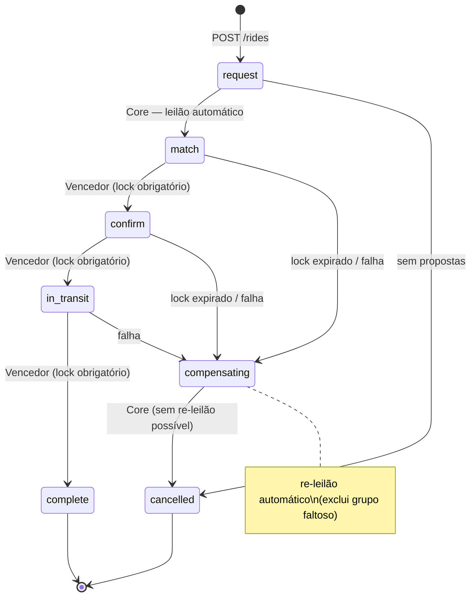

# Máquina de Estados — Saga da Corrida

## Estados

| Estado | Descrição |
|--------|-----------|
| `request` | Corrida solicitada; leilão em andamento |
| `match` | Serviço vencedor selecionado; lock transferido |
| `confirm` | Corrida confirmada pelo motorista do grupo vencedor |
| `in_transit` | Passageiro embarcado; corrida em andamento |
| `complete` | Corrida finalizada com sucesso (terminal) |
| `compensating` | Rollback em andamento — lock expirado ou falha detectada |
| `cancelled` | Corrida cancelada após compensação (terminal) |

---

## Diagrama

---

## Transições Válidas

| De | Para | Quem executa | Requisito |
|----|------|-------------|-----------|
| `request` | `match` | Core (auction worker) | Pelo menos uma proposta recebida |
| `request` | `cancelled` | Core (auction worker) | Nenhuma proposta no leilão |
| `match` | `confirm` | Serviço vencedor | Lock ativo no grupo |
| `match` | `compensating` | Core (lock monitor) | Lock expirado |
| `confirm` | `in_transit` | Serviço vencedor | Lock ativo no grupo |
| `confirm` | `compensating` | Core (lock monitor) | Lock expirado |
| `in_transit` | `complete` | Serviço vencedor | Lock ativo no grupo |
| `in_transit` | `compensating` | Core (lock monitor) | Lock expirado |
| `compensating` | `cancelled` | Core | Re-leilão sem propostas ou falha irrecuperável |

> **Grupos clientes** só podem transitar para: `confirm`, `in_transit`, `complete` (todos requerem lock ativo) e `cancelled` (a partir de `request`). As demais transições são executadas internamente pelo Core.

---

## Regras de Conformização do Core

1. **Timestamp lógico obrigatório:** toda transição deve incluir `logicalTimestamp` maior que o último registrado para a corrida. O Core rejeita com `422` transições com timestamp inferior ou igual (proteção contra eventos atrasados/duplicados).

2. **Lock obrigatório:** apenas o detentor do lock ativo pode transitar para `confirm`, `in_transit` e `complete`. O Core valida a titularidade antes de aplicar a transição (retorna `409` se lock não pertence ao `serviceId`).

3. **Compensação forçada:** o `lock_monitor` detecta locks expirados a cada 5s e força `compensating`. O grupo faltoso é adicionado a `excludedGroups` no re-leilão e seu circuit breaker é incrementado.

4. **Idempotência:** submeter a mesma transição duas vezes (mesmo `serviceId` + `logicalTimestamp`) retorna `200` sem alterar o estado.

5. **Finalidade:** `complete` e `cancelled` são terminais — nenhuma transição é aceita após atingi-los (retorna `422`).

6. **Liberação automática do lock:** ao atingir `complete` ou `cancelled`, o Core libera o lock automaticamente — não é necessário chamar `DELETE /locks/{uuid}`.

---

## Ações de Compensação

| Falha em | O que o Core faz |
|----------|-----------------|
| `match`, `confirm` ou `in_transit` | Expira lock; transiciona para `compensating`; incrementa circuit breaker do grupo faltoso; publica `auction_request` excluindo esse grupo |
| Nenhuma proposta no leilão | Cancela corrida direto (`cancelled`); não há re-leilão |
| Re-leilão também falha | Corrida vai para `cancelled` |
